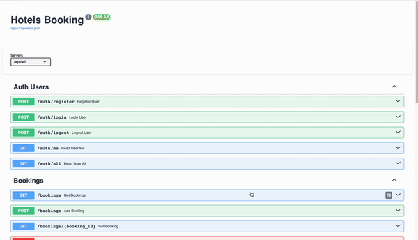
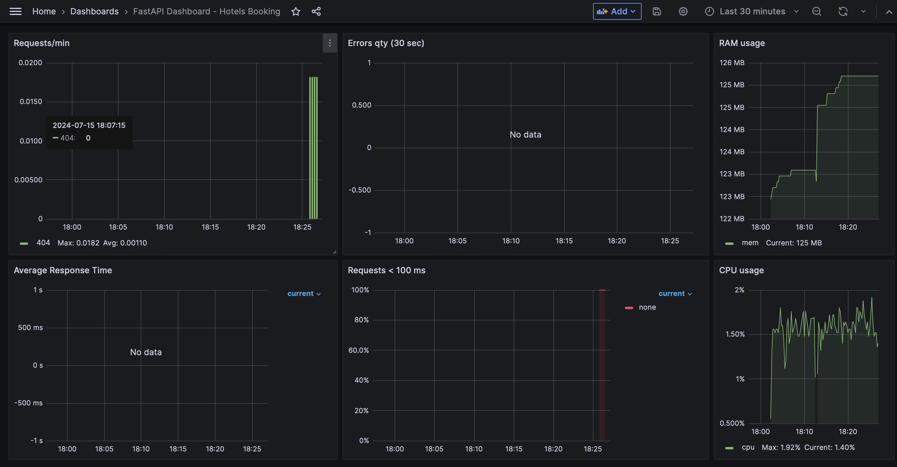

# Hotels Booking BackEnd - FastAPI

FastAPI-based booking application that leverages modern technologies.

## Tech stack:

## API Features

### Users
- **Register User**
- **Log in/out**
- **Display User info**

### Bookings
- **Create**
- **Find**
- **Delete**

### Images
- **Upload Hotel Images**

## Try it out online!
   - Preview [online](https://booking-app-dg6c.onrender.com/api/v1/docs) (please give it some time for the first load as the server is asleep if not used for a while.)

## Screenshots
### API docs:

### Grafana Dashboard:

